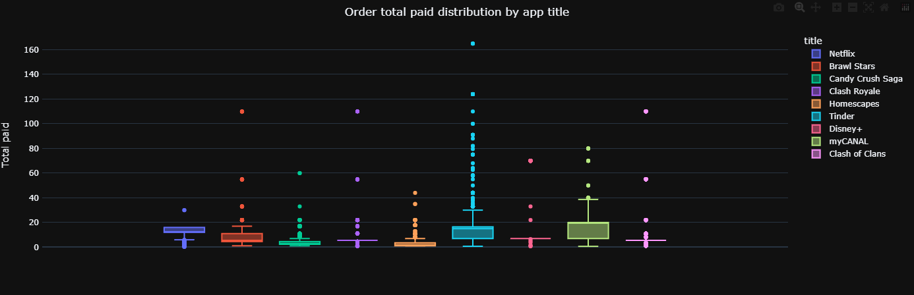
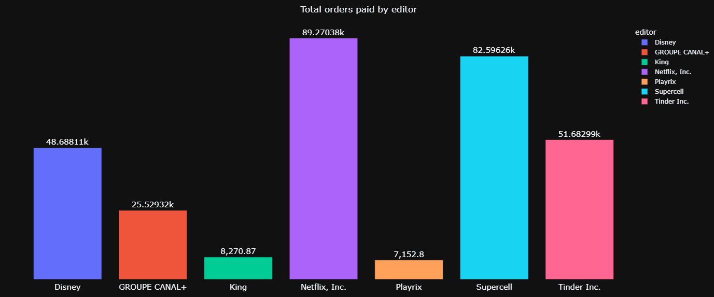
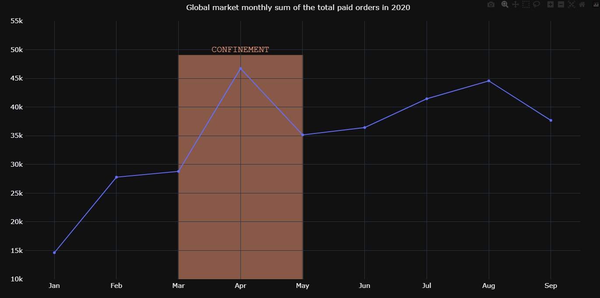
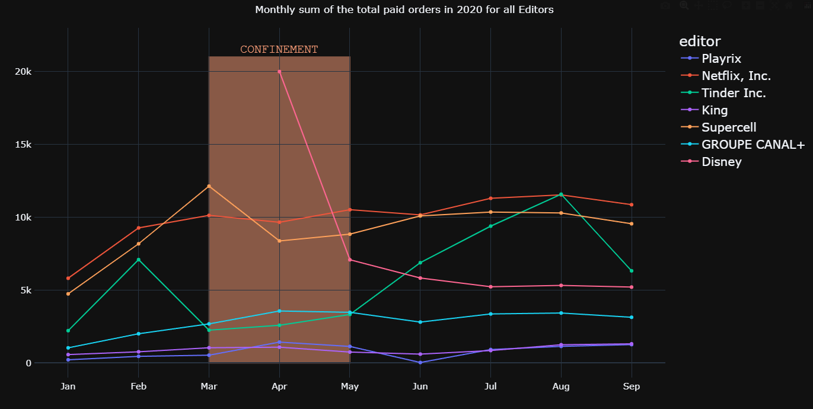
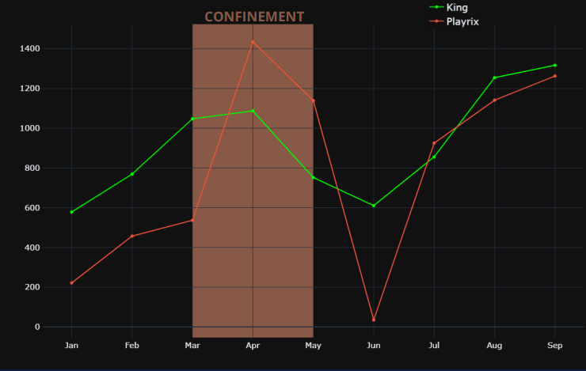
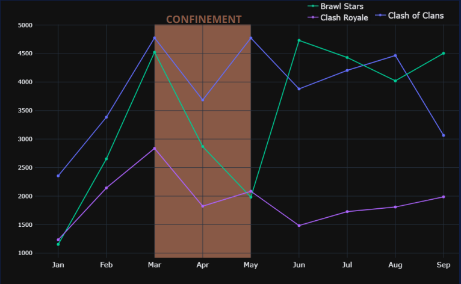
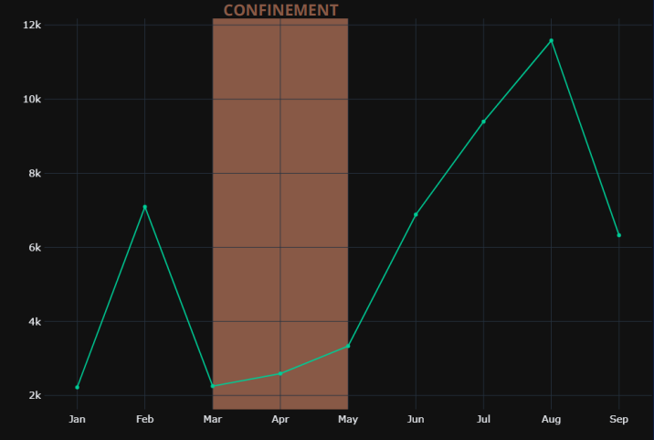
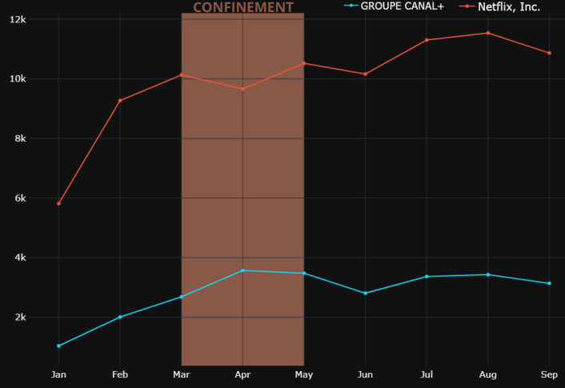

All the orders are mostly between 0 & 20 euros.

Netflix and Supercell represent the largest market share.

The confinement seems to be beneficial for the global market.

Disney has launched their app during the 2020 confinement,
which could explain the global profit of the confinement.
Let's have a look by app domain.

> GAMING APPS

Playrix and King have same trend. The confinement is
beneficial for turnover for the first month but people
lose interest during the second month and the month
after.

During the first month, 2020 confinement had a
negative impact on the 3 Supercell apps. Clash Royale
and Clash of Clans stabilised during the second
month. Brawl Stars was the most impacted but people
regained interest right after.

> DATING/STREAMING APPS

Tinder was very impacted by the covid-19 with a -70%
evolution rate the first month of the confinement. It
seems people had a little interest on Tinder app
during confinement but right after they used it a lot.

Both of the streaming apps seem to have the same
trend. Over the year, Netflix continued to rise but
CANAL + stabilized. It is difficult to estimate the impact
of the covid 19 confinement on those apps.
